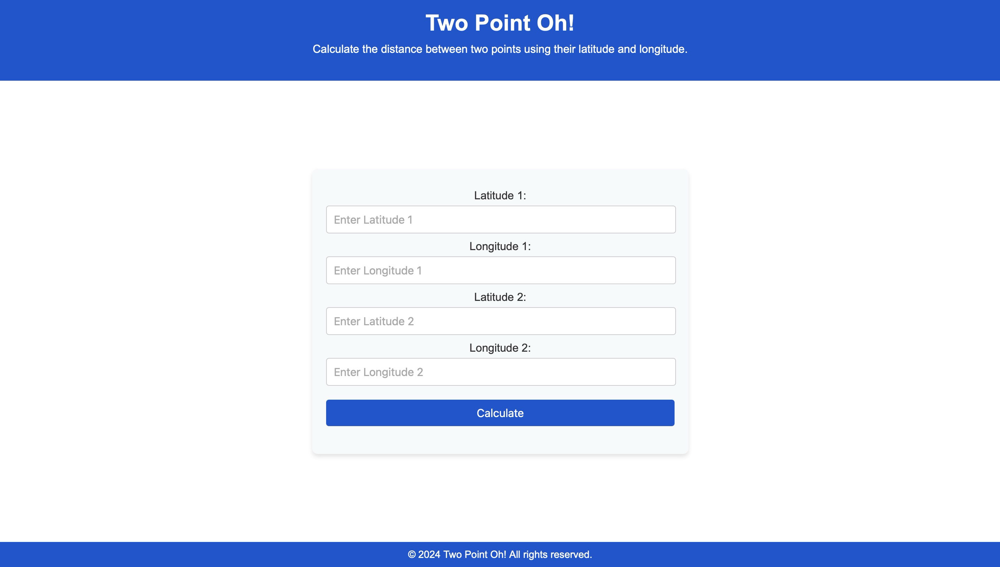

# Building a Dynamic Web App: From Amplify to API Gateway

## Overview

This project is a dynamic web application that calculates the distance between two geographical points using their latitude and longitude. The application is built using HTML, CSS, and JavaScript, and it interacts with an API hosted on AWS.



## Features

- User-friendly interface for inputting latitude and longitude.
- Real-time distance calculation between two points.
- Responsive design for mobile and desktop users.
- Error handling for invalid inputs and API errors.

## Technologies Used

- **HTML**: Structure of the web application.
- **CSS**: Styling and layout of the application.
- **JavaScript**: Functionality and API interaction.
- **AWS**: API Gateway, Lambda, DynamoDB, Amplify, and IAM.

## Getting Started

To run this project locally, follow these steps:

1. **Clone the repository**:
   ```bash
   git clone https://github.com/Terieyenike/aws-web-app.git
   cd aws-web-app
   ```

2. **Open the HTML file**:
   Open `index-FINAL.html` in your web browser.

3. **Usage**:
   - Enter the latitude and longitude for two points in the input fields.
   - Click the "Calculate" button to see the distance between the two points.

## API Integration

The application makes a POST request to an API hosted on AWS. Ensure that the API endpoint is correctly set in the JavaScript code:

```javascript
fetch("REPLACE WITH YOUR API GATEWAY ENDPOINT", {
    method: 'POST',
    headers,
    body,
})
```

## Contributing

Contributions are welcome! Please feel free to submit a pull request or open an issue for any suggestions or improvements.

## License

This project is licensed under the MIT License. See the [LICENSE](LICENSE) file for details.

## Acknowledgments

- [AWS Documentation](https://aws.amazon.com/documentation/)
- [MDN Web Docs](https://developer.mozilla.org/)
